---
### 👉作者QQ ：1556708905 微信：zheng0123Long (支持修改、部署调试、定制毕设)

### 👉接网站建设、小程序、H5、APP、各种系统等

### 👉选题+开题报告+任务书+程序定制+安装调试+ppt 都可以做
---

**毕业设计所有选题地址 [https://github.com/zhengjianzhong0107/allProject](https://github.com/zhengjianzhong0107/allProject)**

**博客地址：[https://blog.csdn.net/2303_76227485/article/details/128665076](https://blog.csdn.net/2303_76227485/article/details/128665076)**

**视频演示：[https://www.bilibili.com/video/BV1xM4y1E7MW/](https://www.bilibili.com/video/BV1xM4y1E7MW/)**

## 基于SpringBoot的健身房管理系统(源代码+数据库)

## 一、系统介绍

### 系统层次结构图如下：

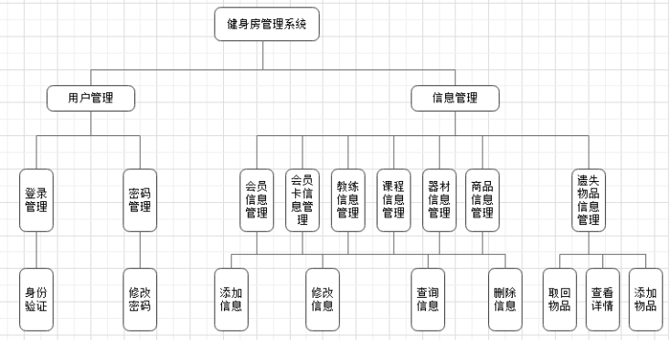

- 管理员登录模块
- 会员管理模块
- 教练管理模块
- 课程管理模块
- 器材管理模块
- 物品遗失管理模块
- 商品管理模块
- 信息统计模块

## 二、所用技术

1. web框架：SpringBoot
2. 数据库框架：Sping Data JPA
3. 数据库：MySql
4. 项目构建工具：Maven
5. 前端模板：JSP
6. 安全框架：Shiro
7. 前端框架：BootStrap,Layui
8. 数据图表：ECharts

## 三、环境介绍

基础环境 :IDEA/eclipse, JDK 1.8, Mysql5.7,Maven

源码+数据库脚本

所有项目以及源代码本人均调试运行无问题 可支持远程调试运行

## 四、页面截图

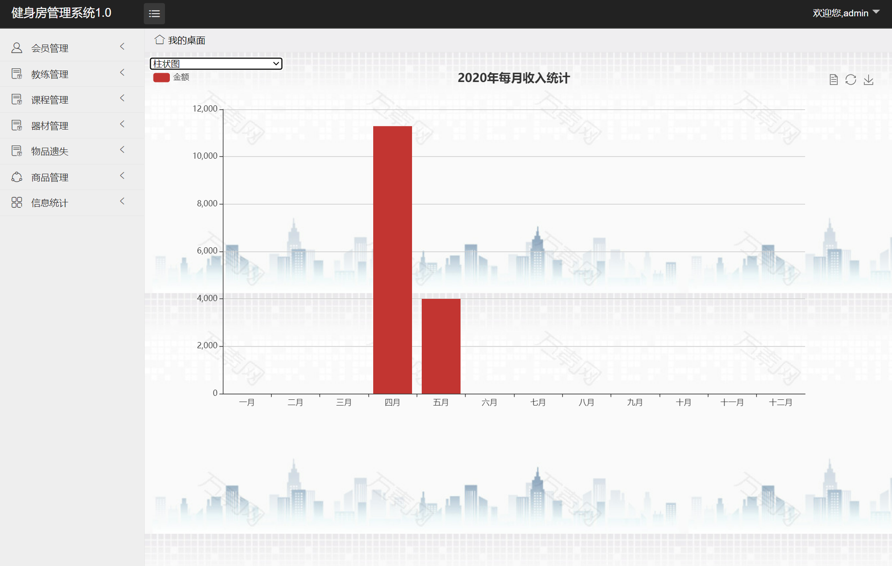

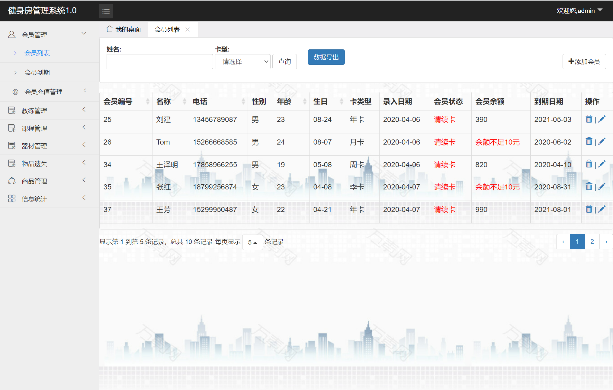

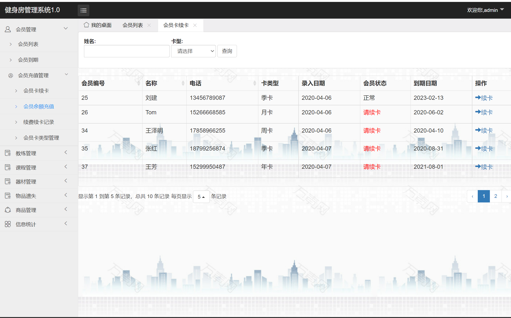

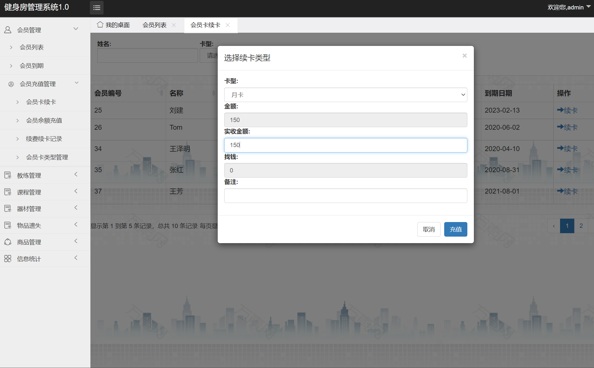

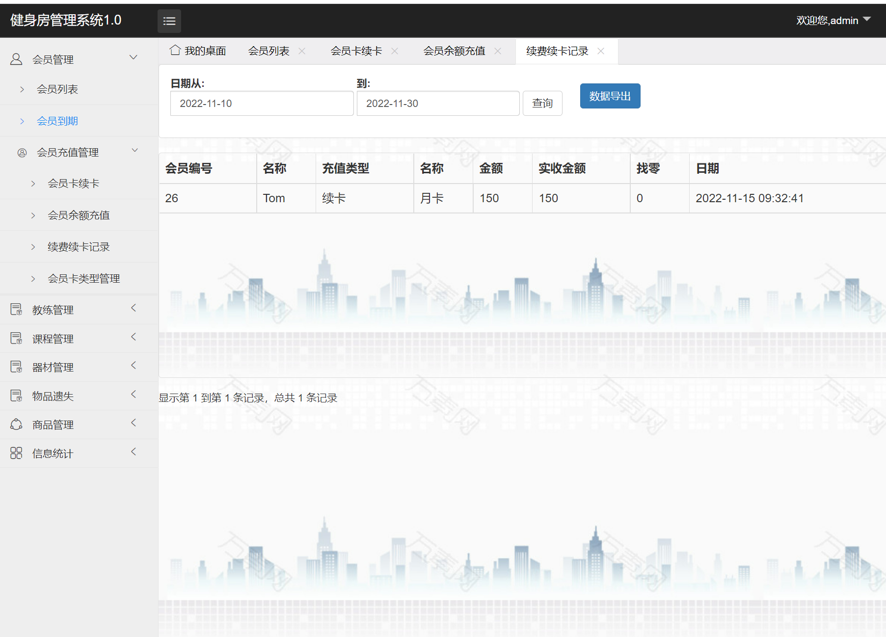

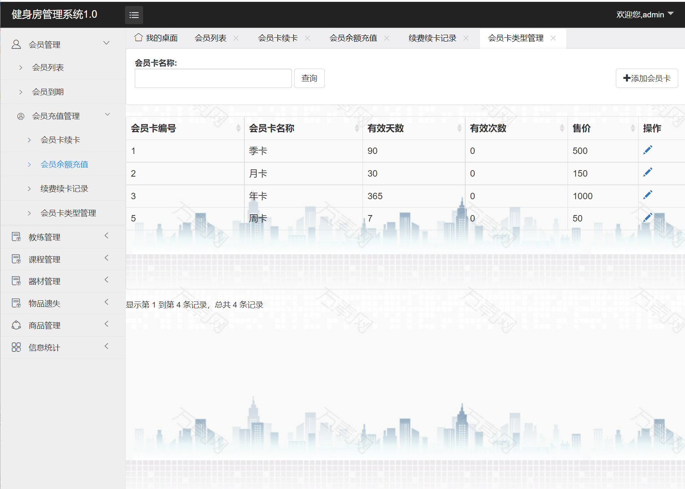

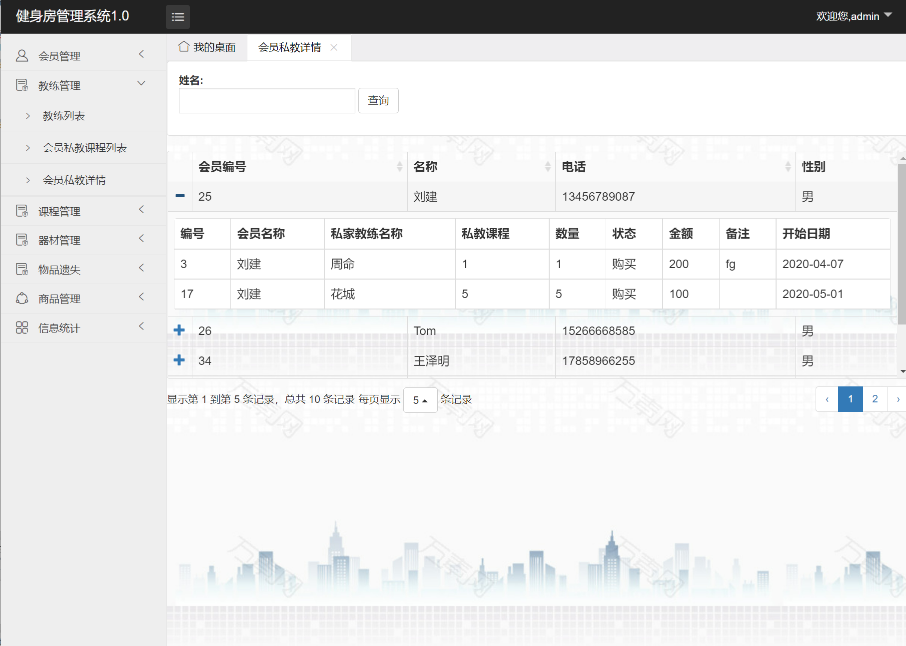

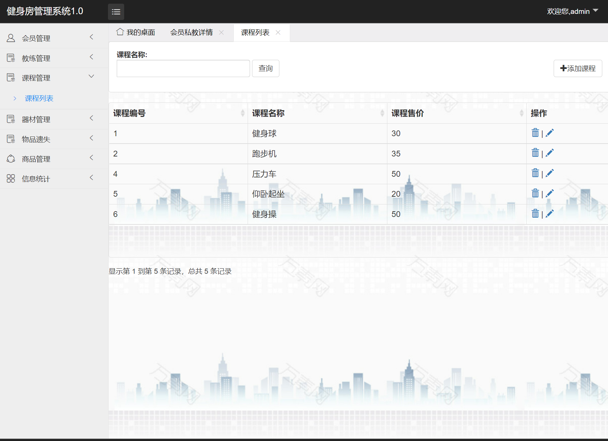

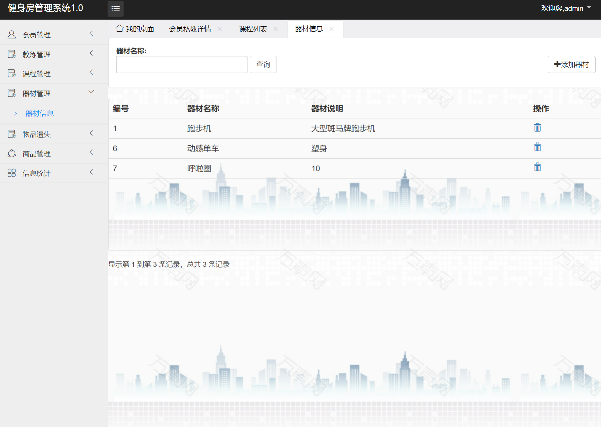

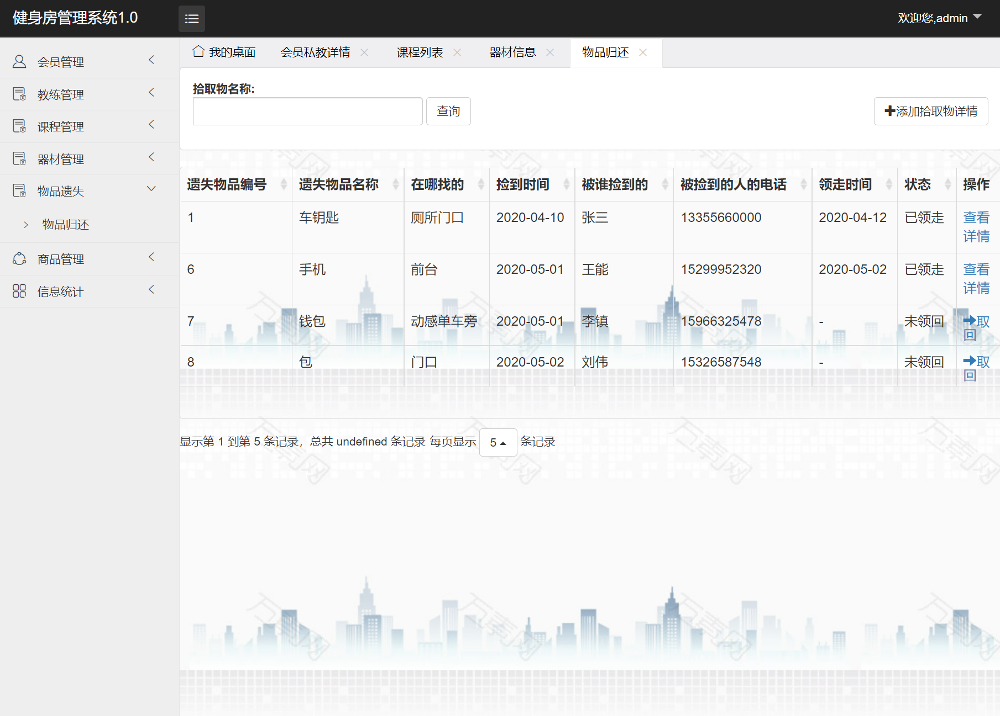

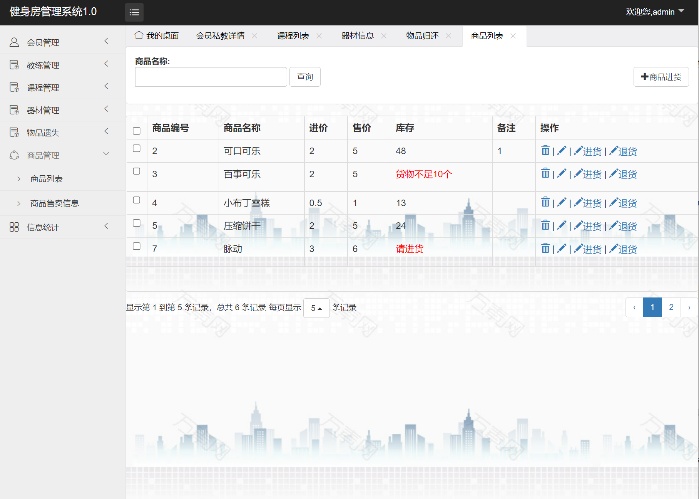

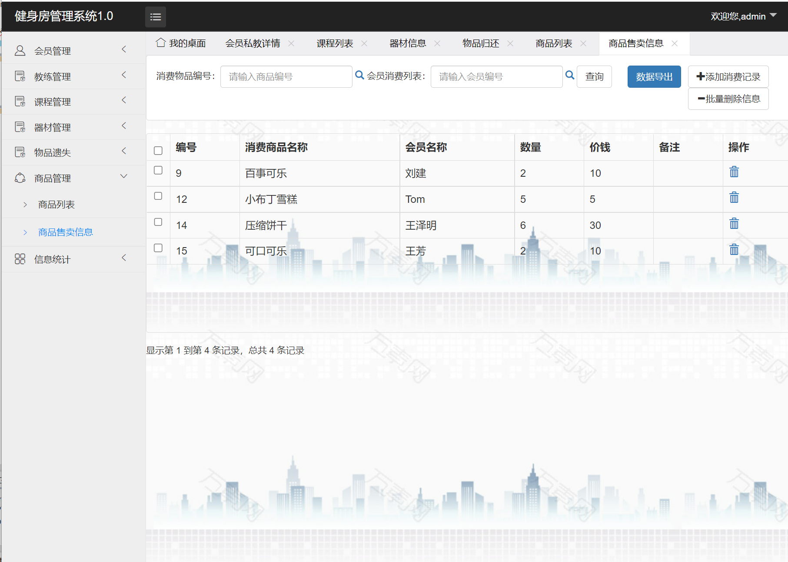

## 五、浏览地址

前端访问地址：http://localhost:8055/

管理员账号/密码：admin/123456

## 六、安装教程

1. 使用Navicat或者其它工具，在mysql中创建对应名称的数据库，并导入项目的sql文件；
2. 使用IDEA/Eclipse导入项目，请选择maven; 若为maven项目，导入成功后请执行maven clean;maven install命令，然后运行；
3. 修改application.yml 里面的数据库配置
4. 启动项目后端项目
